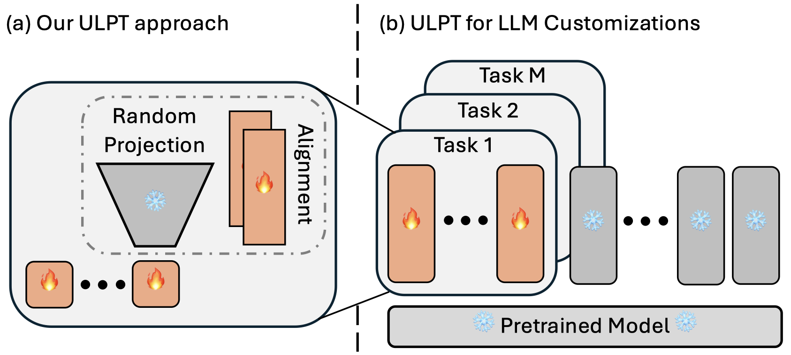

# ULPT: Prompt Tuning with Ultra Low-Dimensional Optimization
This repository provides the code for the paper titled **[ULPT: Prompt Tuning with Ultra Low-Dimensional Optimization]()**

<p align="center">
  </a>
  <br />
</p>

## 🚀 Experiments on Reasoning Tasks
ULPT supports Llama 3.2 Models, we have tested on GSM8K and MBPP datasets, please find it in [Llama_experiments](Llama_expriments)


## 1. Requirements and Installation
```bash 
pip install torch numpy scipy sklearn transformers==4.37.2 peft==0.11.1 datasets==2.16.1 accelerate==0.33.0
```

## 3. Run Experiments
```bash
bash train.sh
```

## Acknowledgement
This repository is built upon the following repositories:
- [DePT](https://github.com/ZhengxiangShi/DePT)
